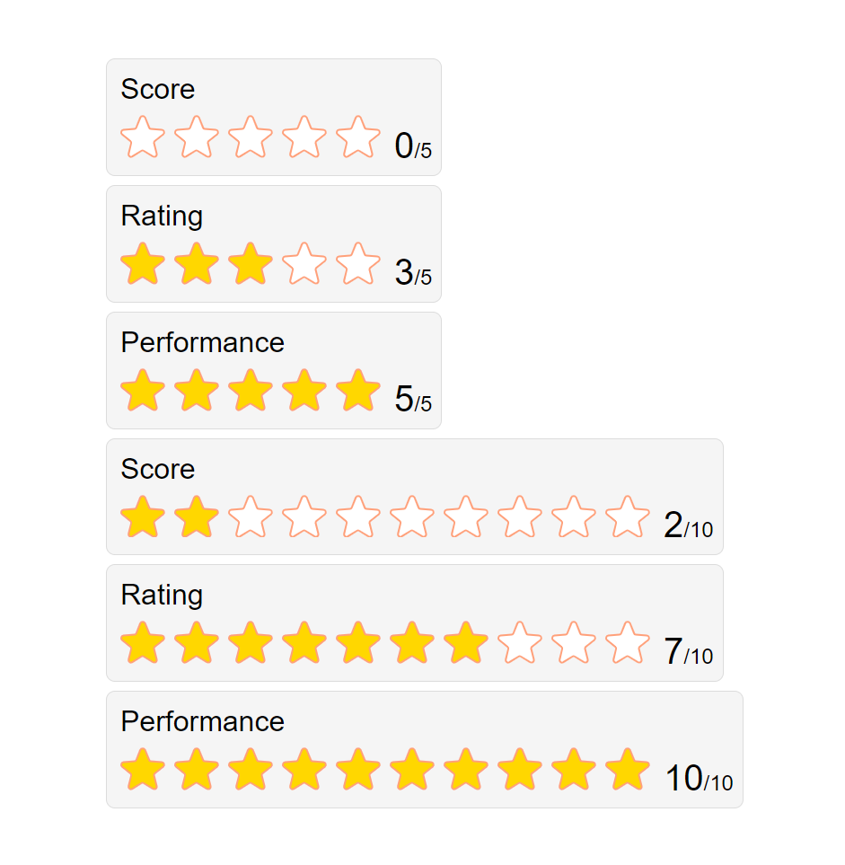

# ReactJS Component: Rating

A customizable rating component built with React.js that allows users to select a rating based on a dynamic number of stars. This component is highly flexible, enabling various configurations through props.

## Screenshot

  <!-- Replace with the path to your screenshot image -->

## Live Demo

You can try out the live demo of this project [here](https://reactjs-rating.vercel.app/).

## Features

- **Customizable Star Count**: Define the maximum number of stars through the `maxRate` prop.
- **Set Initial Rating**: Use the `defaultRate` prop to set the initial rating value.
- **Title Display**: The `title` prop allows you to set a title above the rating component.
- **Dynamic Star Selection**: Click on any star to set a rating between 1 and the maximum star count.
- **Real-time Rating Update**: The selected rating is displayed and updated in real-time as you click on the stars.

## Installation

### Using Create React App

To get started with the project locally using Create React App, follow these steps:

1. **Clone the repository:**

    ```bash
    git clone https://github.com/EthanEDev/reactjs-rating.git
    ```

2. **Navigate to the project directory:**

    ```bash
    cd reactjs-rating
    ```

3. **Install dependencies:**

    ```bash
    npm install
    ```

4. **Start the development server:**

    ```bash
    npm start
    ```

### Using Vite

If the project uses Vite instead of Create React App, follow these steps:

1. **Clone the repository:**

    ```bash
    git clone https://github.com/EthanEDev/reactjs-rating.git
    ```

2. **Navigate to the project directory:**

    ```bash
    cd reactjs-rating
    ```

3. **Install dependencies:**

    ```bash
    npm install
    ```

4. **Start the development server:**

    ```bash
    npm run dev
    ```

## Usage

Once the application is running, you can customize and use the rating component as follows:

- **Default Rate**: Set the initial selected rating using the `defaultRate` prop.
- **Maximum Rate**: Define the maximum number of stars to be displayed using the `maxRate` prop.
- **Title**: Use the `title` prop to display a title above the rating component.
- **Select a Rating**: Click on any star to set a rating up to the `maxRate` value.
- **Display Rating Value**: The selected rating value will be displayed below the stars.

## Technologies Used

- React.js
- JavaScript (ES6+)
- CSS

## Contributing

Contributions are welcome! If you have suggestions for improvements or find bugs, please open an issue or submit a pull request.

1. Fork the repository.
2. Create a new branch (`git checkout -b feature-branch`).
3. Commit your changes (`git commit -am 'Add new feature'`).
4. Push to the branch (`git push origin feature-branch`).
5. Create a new Pull Request.

## License

This project is licensed under the MIT License - see the [LICENSE](LICENSE) file for details.

## Contact

If you have any questions, feel free to reach out to me via GitHub issues or at [ethan.ekhtiyar@gmail.com](mailto:ethan.ekhtiyar@gmail.com).
